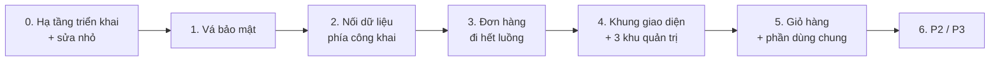

# Kế hoạch làm lại khu quản trị LàngNghề.vn

Sep 25, 2026 · @son

Sàn cần khoảng 60 màn hình (38 trang đã có code), nhưng việc đầu tiên không phải giao diện: phải vá các lỗ hổng phân quyền và nối dữ liệu thật cho trang chủ, trang sản phẩm — hai trang này vẫn là dữ liệu mẫu.

## Tổng quan

Ba khu quản trị cộng phần công khai cần khoảng 60 màn hình; 38 trang đã có code nhưng phần lớn cần làm lại giao diện cho đồng bộ.

| Khu | Đã có | Dùng chung | Mới | Tổng ước tính |
| --- | --- | --- | --- | --- |
| Nhà bán | 8 | 3 (tin nhắn, thông báo, cài đặt thông báo) | 9 | \~20 |
| Buyer | 9 | 2 (tin nhắn, thông báo) | 9 (gồm giỏ hàng, thanh toán, đặt thành công) | \~20 |
| Admin | 4 | 0 | 14 | \~18 |
| Công khai phát sinh thêm | — | — | quản lý banner, khuyến mãi (nếu làm) | +2–4 |

Kết luận chính:

- Trang chủ, trang sản phẩm, danh mục, gian hàng và kết quả tìm kiếm vẫn là dữ liệu viết cứng. Sản phẩm nhà bán đăng lên không bao giờ hiện với buyer.
- Có 8 lỗ hổng phân quyền đang mở trên database; vài lỗ hổng cho phép buyer tự cộng credit hoặc tự xác nhận đơn.
- Luồng đơn hàng dừng ở trạng thái `shipped`: không ai chuyển được sang `delivered` / `completed`, và đơn không có địa chỉ giao.
- Giỏ hàng là thay đổi duy nhất phải sửa cấu trúc bảng `orders` đang có dữ liệu thật; mọi thay đổi khác đều là thêm mới.

Phân tích dựa trên đọc code trong `langnghe-web/src` và 35 migration trong `supabase/migrations`, chưa kiểm tra trực tiếp trên database production.

## Lỗ hổng bảo mật phải vá trước

Tám lỗ hổng dưới đây đang mở (nếu database thật khớp migration trong repo) và phải vá trước khi thêm bất kỳ nút đổi trạng thái nào. Sắp theo mức gấp.

| # | Lỗ hổng | Chỗ trong code | Hậu quả | Cách vá |
| --- | --- | --- | --- | --- |
| 1 | Buyer sửa được mọi cột của `buyer_profiles` | Quy tắc `buyer_profiles_modify_own` (FOR ALL), không có trigger khóa cột như bên supplier | Tự đặt `credit_balance`, reset `quota_used_this_month`, tự đặt `verified_at`, sửa điểm tín nhiệm | Trigger `guard_buyer_system_columns` theo mẫu `guard_supplier_system_columns` |
| 2 | Buyer tự INSERT đơn hàng | Quy tắc `orders_buyer_insert` chỉ kiểm tra `buyer_id` | Tự tạo đơn cho báo giá của mình với `unit_price` = 1đ | Bỏ quy tắc; đơn chỉ được tạo qua `accept_quote` và `checkout_cart` |
| 3 | Buyer và supplier sửa mọi cột của `orders` | Quy tắc `orders_update` | Tự chuyển đơn sang `confirmed` (bỏ qua admin xác nhận tiền) hoặc `completed`; sửa giá, số lượng | Trigger kiểm tra bước chuyển trạng thái theo vai trò + khóa cột giá/số lượng |
| 4 | Ai cũng đọc được mọi cột của `supplier_profiles` | Quy tắc `supplier_profiles_select_all` là `USING (TRUE)` | Lộ `tax_code`, `risk_score`, `trust_score`, `contact_phone` kể cả khi xưởng tắt hiển thị số điện thoại | View `public_supplier_profiles` chỉ gồm cột an toàn; thu hẹp quyền đọc bảng gốc |
| 5 | Supplier tự đổi trạng thái báo giá | Quy tắc `rfq_quotes_supplier_own` (FOR ALL, không giới hạn cột) | Tự đặt báo giá thành `accepted` | Trigger chặn supplier đổi `status`, trừ tự rút báo giá |
| 6 | Khóa tài khoản không có hiệu lực ở database | Middleware có chặn trang riêng tư, nhưng quy tắc phân quyền không kiểm tra `users.status` | Người bị khóa vẫn gọi API trực tiếp được | Hàm `is_active_user()` trong các quy tắc ghi dữ liệu (\~15–20 chỗ) |
| 7 | Sản phẩm của xưởng bị ẩn / bị khóa vẫn hiện công khai | Quy tắc `products_select` chỉ kiểm tra `status = 'active'` | Xưởng nghỉ Tết hoặc bị khóa vẫn nhận đơn | Lọc `is_hidden` và `users.status` ở `products`, `price_tiers`, `product_media`, `product_variants` |
| 8 | Buyer sửa mọi cột của `rfq_requests` | Quy tắc `rfq_requests_buyer_own` (FOR ALL) | Tự đặt `awarded`, sửa số lượng sau khi đã có báo giá | Trigger chỉ cho hủy RFQ và sửa khi chưa có báo giá |

Ngoài ra, thao tác admin đang chạy thẳng từ trình duyệt, nhiều lệnh rời nhau và không có nhật ký. Không phải lỗ hổng, nhưng nên chuyển sang các hàm `admin_*` có ghi nhật ký (xem phần Khu admin).

## Trang công khai: trang chủ và trang sản phẩm

Cả hai trang vẫn là dữ liệu mẫu trong `data.ts`; mọi đường dẫn `/products/[id]` đều ra cùng một sản phẩm và phần lớn nút chưa làm gì. `/categories/[slug]`, `/shops/[id]` và kết quả `/search` cũng chưa nối dữ liệu.

### Trang chủ (logic M, cần cache và làm mới mỗi vài phút)

| Nút / thành phần | Hiện trạng | Cần làm | Database |
| --- | --- | --- | --- |
| Ô tìm kiếm + chọn ngành | Bỏ qua ngành đã chọn | Gửi thêm `category`, gợi ý khi gõ | `search_suggest()`, bỏ dấu tiếng Việt |
| Menu danh mục bên trái | Link sang `/search?q=` | Link `/categories/[slug]` | Đọc `categories` (đã có) |
| Thanh tab điều hướng | Chỉ đổi màu | Mỗi tab là bộ lọc hoặc đường dẫn | Không đổi |
| 2 banner lớn | `href="#"` | Admin quản lý | Bảng mới `banners` + trang admin |
| Danh mục nhanh | `href="#"` | Link sang danh mục | `categories.icon`, `is_featured` |
| Ưu đãi lô hàng tuần này + đếm ngược | Dữ liệu giả | Làm tính năng khuyến mãi hoặc đổi thành "Sản phẩm mới" | `promotions`, `promotion_items` nếu làm |
| Sản phẩm nổi bật | Dữ liệu giả | Xếp hạng tự động hoặc admin chọn | `products.is_featured` hoặc `quality_score` |
| Thẻ sản phẩm | Link tới id giả (`flash-1`) | Id thật, ảnh, giá thấp nhất, MOQ, huy hiệu xác minh | View `product_cards` |
| "Mua sỉ ngay" / "Đăng ký" | Luôn trỏ `/register`, kể cả khi đã đăng nhập | Đổi theo vai trò | Không đổi |
| "Hỗ trợ" | `href="#"` | Zalo OA / email | `platform_settings` |
| Số liệu "1.200+ xưởng" | Viết cứng | Số thật | `public_stats()` |
| Biểu tượng giỏ hàng | Chưa có | Có số mặt hàng | `cart_items` |

### Trang sản phẩm (logic L)

| Nút / thành phần | Hiện trạng | Cần làm | Database |
| --- | --- | --- | --- |
| Thư viện ảnh / video | Emoji giả | Ảnh thật, đổi ảnh theo biến thể | `product_media.variant_id` |
| Bảng bậc giá | Chạy được, giá giả | Đọc `price_tiers` | Không đổi |
| Chọn biến thể | Không ảnh hưởng giá | Cộng `price_adjustment`, báo hết hàng | `product_variants.is_active` |
| Nút + / − số lượng | MOQ và bước tăng là hằng số giả | Lấy `min_order_qty`, tự áp bậc giá | `products.qty_step` (tùy chọn) |
| Gửi yêu cầu báo giá | Popup, nút Gửi chỉ đóng popup | Gọi `create-rfq` kèm sản phẩm + xưởng; khách thì đăng nhập rồi quay lại | Thêm `p_product_id` vào `create_rfq()` |
| Đặt hàng ngay | Không có `onClick` | Tách "Thêm vào giỏ" và "Mua ngay" | `cart_items`, `checkout_cart()` |
| Nhắn tin cho xưởng | Không có `onClick` | Mở hội thoại | Sửa mô hình tin nhắn (xem Khu buyer) |
| Xem gian hàng | Không có `onClick` | Link `/shops/[id]` | Không đổi |
| Tab mô tả / thông số / đánh giá | Nội dung giả | Đọc dữ liệu thật | `products.specs` JSONB, `reviews` |
| Sản phẩm liên quan | `href="#"` | Cùng danh mục hoặc xưởng | Không đổi |
| Huy hiệu xác minh, OEM | Viết cứng | Lấy từ dữ liệu | `supplier_profiles.verified_at` |
| Thiếu: Lưu, Chia sẻ, Báo cáo vi phạm | — | Thêm | `saved_items`, `content_reports` |
| Thiếu: "Sửa sản phẩm" khi xưởng xem hàng của mình | — | Ẩn nút mua, hiện nút sửa | Không đổi |
| Thiếu: đã bán, lượt xem | — | Hiển thị | `order_items`, `interaction_events` |

Khối đặt hàng phải xử lý các trường hợp: khách / buyer / supplier / chủ sản phẩm, buyer chưa xác minh, sản phẩm tạm ẩn hoặc bị khóa, xưởng đang ẩn, hết hàng, dưới MOQ. Cần thêm `generateMetadata`, ảnh chia sẻ riêng và 404 đúng cho sản phẩm không tồn tại.

### Vấn đề database riêng của phần công khai

- Tìm kiếm dùng cấu hình `'simple'`, không có `unaccent`: gõ "gom su" không ra "gốm sứ". Cần viết lại `search_vector` (thêm tên xưởng, làng nghề, danh mục) và cập nhật lại dữ liệu cũ.
- `create_rfq()` không nhận `p_product_id`, nên RFQ gửi từ trang sản phẩm mất liên kết sản phẩm.
- Nên thêm `supplier_profiles.slug` và `products.slug` cho link đẹp khi chia sẻ qua Zalo và cho SEO.

## Khu nhà bán

Khu nhà bán cần khoảng 20 màn hình: 8 trang làm lại giao diện gần như không đổi database, 9 trang mới thì 5 trang cần thay đổi database. Thang logic: S = đọc và hiển thị; M = lọc, gộp số liệu, 1–2 thao tác ghi; L = ghi nhiều bảng, luồng trạng thái hoặc file.

| Trang | Route | Trạng thái | Ưu tiên | Logic | Database |
| --- | --- | --- | --- | --- | --- |
| Dashboard | `/supplier/dashboard` | Có | — | M | Nên có `supplier_dashboard_stats()` |
| Danh sách sản phẩm | `/supplier/products` | Có | — | M | Không đổi |
| Thêm sản phẩm | `/supplier/products/new` | Có | — | L | `save_product()` |
| Sửa sản phẩm | `/supplier/products/[id]/edit` | Có, phải viết lại phần lưu | P1 | L | `save_product()`, `product_variants.is_active` |
| Nhập sản phẩm từ Excel | `/supplier/products/import` | Mới | P2 | L | `bulk_save_products()`, `product_import_jobs` |
| Hộp RFQ | `/supplier/rfq` | Có | — | M | Không đổi |
| Chi tiết RFQ + báo giá | `/supplier/rfq/[id]` | Mới | P1 | L | Enum `withdrawn`, sửa unique index, `rfq_quote_revisions` |
| Báo giá đã gửi | `/supplier/quotes` | Mới | P1 | S–M | Không đổi (`quote_win_rate` đã có) |
| Danh sách đơn | `/supplier/orders` | Có | — | M | Không đổi |
| Chi tiết đơn | `/supplier/orders/[id]` | Mới | P1 | L | `order_documents` + bucket, `add_order_note()`, loại event mới |
| Tranh chấp | `/supplier/disputes` | Mới | P1 | M | `dispute_messages` + bucket |
| Tài chính và đối soát | `/supplier/finance` | Mới | P2 | L | `supplier_bank_accounts`, `supplier_payouts`, `payout_items`, phí sàn |
| Khách hàng | `/supplier/customers` | Mới | P2 | M | View gộp theo buyer, `supplier_customer_notes` |
| Đánh giá | `/supplier/reviews` | Mới | P3 | M | `reviews` + trigger `rating_avg` |
| Cài đặt gian hàng | `/supplier/settings/shop` | Có | — | S | Không đổi |
| Phân tích | `/supplier/analytics` | Có | — | M | Không đổi |
| Hồ sơ & xác minh | `/supplier/settings/profile` | Có | — | M | Không đổi |
| Gói thành viên nhà bán | `/supplier/settings/membership` | Mới | P2 | M | `membership_plans.target_role`, trigger đồng bộ `membership_tier` |
| Nhân viên & phân quyền | `/supplier/settings/team` | Mới | P3 | L | `supplier_members` + viết lại \~34 điều kiện `sp.user_id = auth.uid()` |
| Dùng chung | `/messages`, `/notifications`, `/settings/notifications` | Có | — | — | Không đổi |

Ghi chú quan trọng:

- **Sửa sản phẩm:** form hiện xóa toàn bộ bậc giá và biến thể rồi thêm lại, không kiểm tra lỗi và không nằm trong transaction. Mỗi lần sửa biến thể nhận id mới, nên sẽ vỡ khi giỏ hàng và dòng đơn hàng tham chiếu `variant_id`. Trang sửa cần thêm: đổi trạng thái ngay trên trang, cảnh báo đổi giá khi sản phẩm đang trong giỏ, xem trước, nhân bản, số lượt xem.
- **Chi tiết đơn:** supplier không có quyền INSERT `order_events` (chỉ trigger ghi), nên ghi chú phải đi qua hàm. Đơn đặt từ giỏ cần nút "Nhận đơn / Từ chối" ở trạng thái `pending_confirmation`.
- **Tranh chấp:** hiện chỉ admin tạo/cập nhật được `disputes`, supplier không có chỗ giải trình.
- **Tài chính:** chưa code được cho tới khi chốt quy trình tiền.
- **Nhân viên:** `supplier_profiles.user_id` là UNIQUE, mỗi xưởng một tài khoản. Thêm nhân viên là thay đổi rủi ro nhất, để cuối.

## Khu buyer

Khu buyer cần khoảng 20 màn hình; việc gấp nhất là làm cho đơn hàng đi hết luồng (địa chỉ giao, xác nhận nhận hàng), sau đó mới tới giỏ hàng.

| Trang | Route | Trạng thái | Ưu tiên | Logic | Database |
| --- | --- | --- | --- | --- | --- |
| Dashboard | `/dashboard` | Có (2 link hỏng) | — | M | Nên có `buyer_dashboard_stats()` |
| Gửi RFQ | `/rfq/new` | Có | — | L | Kiểm tra lại sau khi khóa cột credit |
| Danh sách RFQ | `/rfq` | Có | — | M | Không đổi |
| Chi tiết RFQ + trả giá / từ chối | `/rfq/[id]` | Có, thêm khối mới | P1 | M–L | `rfq_quote_revisions`, `counter_quote()`, `reject_quote()`, sửa `accept_quote` |
| Danh sách đơn | `/orders` | Có | — | M | Không đổi |
| Tình trạng đơn hàng | `/orders/[id]` (+ `/orders/[id]/track`) | Có, nâng cấp lớn | P1 | L | Realtime, `order_items`, `order_documents`, `shipments` (nếu giao nhiều đợt) |
| Giỏ hàng | `/cart` | Mới | P1 | M | `cart_items` |
| Thanh toán đơn | `/checkout` | Mới | P1 | L | `checkout_cart()`, sửa cấu trúc `orders` |
| Đặt hàng thành công | `/checkout/success` | Mới | P1 | S | Không đổi |
| Sổ địa chỉ giao hàng | `/settings/addresses` | Mới | P1 | M | `buyer_addresses`, sửa `accept_quote` chép địa chỉ |
| Tranh chấp của tôi | `/disputes` | Mới | P1 | M | `open_dispute()`, `dispute_messages` (dùng chung) |
| Tài khoản & bảo mật | `/settings/account` | Mới | P1 | S | Không đổi (Supabase Auth) |
| Hồ sơ & xác minh | `/settings/profile` | Có | — | M | Test lại sau khi khóa cột |
| Cài đặt thông báo | `/settings/notifications` | Có | — | S | Không đổi |
| Membership & credit | `/settings/membership` | Có | — | M | Không đổi |
| Đã lưu | `/saved` | Mới | P2 | S | `saved_items` |
| Lịch sử thanh toán | `/settings/billing` | Mới | P2 | M | `payment_transactions` (cùng mục 9.2 roadmap) |
| Đánh giá của tôi | `/reviews` | Mới | P3 | M | `reviews`, `submit_review()` |
| Nhân viên mua hàng | `/settings/team` | Mới | P3 | L | `buyer_members` + viết lại \~16 điều kiện `bp.user_id = auth.uid()` |

### Luồng đơn hàng đang bị hở

- Không có chỗ nào (buyer, supplier, admin) chuyển đơn sang `delivered` / `completed`. `completed_at`, `on_time_rate`, đánh giá đều không có dữ liệu; `supplier_profiles.total_orders` cũng không được cộng.
- `orders.shipping_address` không bao giờ được ghi.
- Cần job tự hoàn tất đơn sau N ngày nếu buyer không xác nhận (`pg_cron` hoặc Edge Function theo lịch).

### Trang tình trạng đơn hàng

| Phần | Logic | Database |
| --- | --- | --- |
| Thanh tiến trình theo trạng thái (gồm trạng thái mới của đơn từ giỏ) | S | Theo enum mới |
| Cập nhật trực tiếp không cần tải lại | M | Thêm `orders`, `order_events` vào Supabase Realtime |
| Danh sách từng mặt hàng | S | `order_items` |
| Vận chuyển: đơn vị, mã vận đơn, nút tra cứu | S | Cột đã có; link theo mẫu từng đơn vị |
| Giao nhiều đợt | M | `shipments` (cần quyết định) |
| Thanh toán: thông tin chuyển khoản, tải biên lai | M | `order_documents`, `platform_settings` |
| Xác nhận đã nhận, mở khiếu nại, mua lại | M | Trigger chuyển trạng thái, `open_dispute()` |

Trang tra cứu nhanh `/orders/[id]/track` để dán qua Zalo vẫn bắt buộc đăng nhập.

### Giỏ hàng

Đơn hiện chỉ sinh ra từ RFQ (`orders.rfq_quote_id` NOT NULL), mỗi đơn 1 sản phẩm, `total_amount` tính cố định bằng `quantity × unit_price`. Hàm `checkout_cart()` chạy trong 1 transaction:

1. Kiểm tra từng mặt hàng: sản phẩm `active`, xưởng không bị ẩn/khóa, số lượng ≥ MOQ.
2. Tính lại giá phía server theo bậc giá + `price_adjustment`, không tin giá từ trình duyệt.
3. Kiểm tra và trừ tồn kho nếu áp dụng.
4. Tách thành mỗi xưởng một đơn, ghi `orders` + `order_items`, lưu cứng tên và giá.
5. Xóa mặt hàng đã đặt khỏi giỏ, gửi thông báo cho từng xưởng.

| Thay đổi | Loại | Mức |
| --- | --- | --- |
| `cart_items` + quy tắc chỉ chủ giỏ xem/sửa | Thêm mới | Thấp |
| `order_items` + tạo 1 dòng cho mỗi đơn RFQ cũ | Thêm mới + điền dữ liệu cũ | Trung bình |
| `rfq_quote_id` cho phép trống, thêm `source` (`rfq` / `direct`) | Sửa cấu trúc | Trung bình |
| `total_amount` từ cột tự tính sang cột thường | Sửa cấu trúc | Cao: mọi trang đọc `quantity` / `unit_price` của đơn phải chuyển sang `order_items` |
| Trạng thái `pending_confirmation` | Thêm enum | Trung bình |
| Thông báo `order_placed`, `order_declined` | Thêm enum | Thấp |
| `checkout_cart()` | Thêm mới | Logic nặng nhất |

Giỏ hàng làm thay đổi cả khu nhà bán (hiển thị nhiều dòng hàng, nút nhận/từ chối đơn) và khu admin (lọc theo nguồn đơn). Phải chạy thử migration trên bản sao database trước.

### Mô hình tin nhắn

`rfq_messages.rfq_id` là NOT NULL nên không nhắn được cho xưởng nếu chưa có RFQ. Đề xuất tạo bảng `conversations` (buyer, supplier, sản phẩm hoặc RFQ tùy chọn) và chuyển tin nhắn sang; cần viết lại `/messages`, Realtime, quy tắc phân quyền, `mark_thread_read` và chuyển dữ liệu cũ.

## Khu admin

Khu admin có 4 trang và cần thêm 14 (cộng 2 trang banner, khuyến mãi phát sinh từ trang chủ); nguyên tắc chung là mọi thao tác admin đi qua hàm `admin_*` chạy trong 1 transaction và ghi nhật ký.

| Trang | Route | Trạng thái | Ưu tiên | Logic | Database |
| --- | --- | --- | --- | --- | --- |
| Dashboard (hàng đợi việc) | `/admin` | Có | — | M | `admin_queue_counts()` |
| Danh sách user | `/admin/users` | Có | — | M | `admin_set_user_status()`, `is_active_user()` trong quy tắc ghi |
| Chi tiết user | `/admin/users/[id]` | Mới | P1 | M | `admin_adjust_score()`, `admin_grant_credit()` |
| Duyệt xác minh | `/admin/verifications` | Có | — | M | `supplier_profiles.verified_at` |
| Danh sách đơn | `/admin/orders` | Có | — | M | Không đổi |
| Chi tiết đơn (đối chiếu thanh toán) | `/admin/orders/[id]` | Mới | P1 | L | `paid_amount`, `paid_at`, `admin_confirm_payment()` |
| Tranh chấp | `/admin/disputes` | Mới | P1 | L | `admin_resolve_dispute()`, bảng `refunds`, `opened_by_role` |
| Giám sát RFQ | `/admin/rfqs` | Mới | P2 | M | `flagged_at`, `flag_reason` |
| Kiểm duyệt sản phẩm | `/admin/products` | Mới | P1 | M | Enum `blocked`, `moderation_note`, trigger chặn supplier sửa, `content_reports` |
| Danh mục ngành hàng | `/admin/categories` | Mới | P1 | M | `categories.is_active` |
| Kiểm duyệt đánh giá | `/admin/reviews` | Mới | P3 | S | `reviews.hidden_at` |
| Gói thành viên, quota, credit | `/admin/membership` | Mới | P2 | M | `admin_assign_membership()` |
| Tài chính và đối soát | `/admin/finance` | Mới | P2 | L | `refunds`, `supplier_payouts`, `payment_transactions` |
| Báo cáo toàn sàn | `/admin/reports` | Mới | P2 | M–L | Materialized view + `pg_cron` |
| Cài đặt sàn | `/admin/settings` | Mới | P1 | S | `platform_settings` |
| Nhật ký hoạt động | `/admin/audit-log` | Mới | P1 | S | `admin_audit_log` |
| Mẫu thông báo | `/admin/notification-templates` | Mới | P3 | S | Bảng đã có; sửa \~6 trigger để đọc mẫu |
| Quản trị viên và phân quyền nội bộ | `/admin/staff` | Mới | P3 | L | `admin_permissions`, thay \~40 chỗ `is_admin()` |
| Quản lý banner, khuyến mãi | `/admin/banners`, `/admin/promotions` | Mới | P2 | M | `banners`, `promotions` (phát sinh từ trang chủ) |

Vấn đề logic hiện tại:

- **Khóa tài khoản:** middleware có chặn trang riêng tư, nhưng quy tắc phân quyền không chặn API; sản phẩm và gian hàng của xưởng bị khóa vẫn hiện và vẫn nhận RFQ.
- **Thao tác rời nhau:** khóa tài khoản là UPDATE `users` rồi INSERT `notifications` riêng; lệnh sau lỗi thì người dùng bị khóa mà không nhận thông báo. Không có nhật ký admin.
- **Tranh chấp chỉ lưu quyết định:** trạng thái đơn không đổi, không có bản ghi hoàn tiền. Khi admin tạo tranh chấp, `raised_by` bị gán bằng id của buyer.
- **Xác nhận thanh toán** chỉ ghi `payment_note` dạng chữ, không có số tiền thực nhận.
- **Danh mục** chỉ tạo được bằng migration.

## Liên kết và luồng giữa các khu

Quét tự động \~40 đích đến trong `src/`: chỉ 2 link trỏ tới trang không tồn tại, nhưng mọi đường từ khu quản trị ra phía công khai đều dẫn tới dữ liệu mẫu, và phía nhà bán thiếu các trang chi tiết nên thông báo chỉ dẫn về danh sách.

### Link hỏng và link dẫn tới dữ liệu mẫu

| Link | Nằm ở | Vấn đề |
| --- | --- | --- |
| `/membership` | `dashboard/page.tsx` | Không tồn tại, đúng là `/settings/membership` |
| `/profile` | `dashboard/page.tsx` | Không tồn tại, đúng là `/settings/profile` |
| `href="#"` | 9 file (trang chủ, sản phẩm liên quan, tìm kiếm, danh mục, giới thiệu, header) | Bấm không đi đâu |
| Nhà bán → "Xem" sản phẩm | `ProductTable` → `/products/[id]` | Xưởng thấy sản phẩm mẫu của người khác |
| Buyer → tên xưởng trong đơn | `/orders/[id]` → `/shops/[id]` | Hiện gian hàng mẫu |
| Trang chủ / tìm kiếm → thẻ sản phẩm | `/products/flash-1`… | Id giả |
| Trang chủ → menu danh mục | `/search?q=` | Không sang `/categories/[slug]` |

### Luồng bị đứt

| Luồng | Phía buyer | Phía nhà bán | Chỗ đứt |
| --- | --- | --- | --- |
| Khách bấm nút cần đăng nhập | Middleware chuyển sang `/login` | — | Không nhớ trang cũ; cần `?next=` (chỉ nhận đường dẫn nội bộ) |
| Tài khoản mới `pending` | Bị đẩy về `/` | Bị đẩy về `/` | Nên đưa tới bước Hoàn thiện hồ sơ |
| RFQ → báo giá | `/rfq/[id]` | Báo giá qua popup, không có trang chi tiết | `rfq_received` chỉ trỏ về danh sách |
| Báo giá được chấp nhận | Tạo đơn | `quote_accepted` → `/supplier/rfq` | Phải trỏ sang đơn vừa tạo |
| Đơn hàng | `/orders/[id]` | Không có `/supplier/orders/[id]` | Thông báo về đơn chỉ dẫn về danh sách |
| Giao hàng → hoàn tất | Không có nút nhận hàng | Có nút `shipped` | Đơn dừng ở `shipped` |
| Tranh chấp | Không có trang | Không có trang | `dispute_*` dẫn về danh sách đơn |
| Nhắn tin | Qua `/rfq/[id]` | `/messages` | Không nhắn được từ trang sản phẩm / gian hàng |
| Xem gian hàng | Link `/shops/[id]` | Menu không có "Xem gian hàng của tôi" | Trang gian hàng là dữ liệu mẫu |

### Phân quyền theo vai trò

- Middleware chỉ tách `/admin`. Giữa khu buyer và `/supplier` không có kiểm tra vai trò; việc chặn rải rác trong từng trang (supplier mở `/settings/membership` thấy trang của buyer).
- Vai trò `both` không có đường chuyển qua lại hai khu; `resolveHref` của thông báo chỉ biết `buyer | supplier`.

### Liên kết cần có sau khi làm lại

- Trang sản phẩm: tên xưởng → `/shops/[id]`; breadcrumb → `/categories/[slug]`; Gửi RFQ → `/rfq/new?product=[id]`; Nhắn tin → `/messages/new?supplier=&product=`; chủ sản phẩm → `/supplier/products/[id]/edit`.
- Trang gian hàng: sản phẩm → `/products/[id]`; "Gửi RFQ cho xưởng này" → `/rfq/new?supplier=[id]`.
- Khu nhà bán: menu "Xem gian hàng"; đơn → `/supplier/orders/[id]`; RFQ → `/supplier/rfq/[id]`.
- Thông báo: viết lại `resolveHref` để trỏ đúng trang chi tiết cho mọi vai trò.

### Cách chuyển trang và ô tìm kiếm

Hầu hết link dùng `<Link>` của Next.js: URL đổi sang trang mới nhưng trình duyệt không tải lại toàn bộ, chỉ thay phần nội dung thay đổi, và ở bản chạy thật các link trên màn hình được tải trước. Menu danh mục, tab, ảnh sản phẩm, bậc giá, nút +/−, popup RFQ chỉ đổi trạng thái trên trang, không chuyển trang.

| Chỗ | Hiện trạng | Hậu quả | Cách sửa |
| --- | --- | --- | --- |
| Ô tìm kiếm trên trang chủ (`SiteHeader.tsx`) | Form HTML thường `action="/search"` | Tải lại toàn bộ trang | `<Form action="/search">` của `next/form` |
| Ô tìm kiếm trên trang sản phẩm, danh mục, gian hàng, giới thiệu (`PublicHeader.tsx`) | Gọi `onSearch` nhưng 4 trang này không truyền hàm vào | Gõ rồi Enter không có gì xảy ra (chỉ `/search` và trang 404 chạy) | Dùng chung `next/form`, bỏ phụ thuộc vào `onSearch` |
| Trạng thái đang tải | Chưa trang nào có `loading.tsx` | Khi nối database, bấm sản phẩm sẽ có khoảng dừng không phản hồi | Khung chờ (skeleton) cho trang sản phẩm, danh mục, tìm kiếm |

Tùy chọn **xem nhanh sản phẩm**: dùng intercepting routes của Next.js để bấm sản phẩm ở trang chủ thì mở popup đè lên trang chủ. URL vẫn đổi sang `/products/[id]`; bấm Back quay lại đúng chỗ đang cuộn; mở link trực tiếp thì ra trang đầy đủ. Cần thiết kế thêm một bản sản phẩm rút gọn.

## Công cụ upload và chỉnh sửa sản phẩm

Form sản phẩm nên làm dạng từng bước trên điện thoại (Ảnh → Thông tin → Giá & biến thể → Xem trước), vì phần lớn chủ xưởng đăng hàng bằng điện thoại qua 4G; nhập Excel và sửa hàng loạt là công cụ cho máy tính.

### Form hiện tại đang thiếu

| Thiếu | Hậu quả |
| --- | --- |
| Không nén ảnh, upload file gốc (tối đa 10 ảnh × 10MB) | Chậm, dễ đứt qua 4G, tốn dung lượng, trang công khai tải nặng |
| Không nhận HEIC | Ảnh iPhone bị báo lỗi |
| `thumbnail_url` luôn trống | Thẻ sản phẩm phải tải ảnh gốc |
| Không kéo thả sắp xếp, đổi ảnh chính | Phải xóa rồi upload lại |
| Không có ô nhập `price_adjustment` | Mọi biến thể cùng giá dù cột đã có |
| Biến thể nhập từng dòng | 5 màu × 4 size = 20 dòng nhập tay |
| Ảnh không gắn biến thể | Chọn màu đỏ nhưng ảnh không đổi |
| Không có video | Hàng thủ công cần video quy trình |

### P1: cần có khi làm lại form

| Công cụ | Thư viện | Dùng để | Database |
| --- | --- | --- | --- |
| Nén và thu nhỏ ảnh trên máy | `browser-image-compression` | Cạnh dài ≤ 2000px, WebP \~80%: 6MB xuống \~300–500KB; tạo bản \~400px làm `thumbnail_url` | Giảm giới hạn bucket xuống \~3MB |
| Đọc ảnh iPhone | `heic2any` (chỉ tải khi gặp HEIC) | HEIC → JPEG rồi nén | Không đổi |
| Kéo thả sắp xếp ảnh | `@dnd-kit/sortable` | Sắp thứ tự, chọn ảnh chính, dùng được trên điện thoại | Không đổi |
| Chụp ảnh trực tiếp | `<input capture="environment">` | Mở thẳng camera | Không đổi |
| Form + kiểm tra dữ liệu | `react-hook-form` + `zod` | Kiểm tra khi nhập, cùng quy tắc với `save_product()`, lưu nháp, cảnh báo rời trang | Không đổi |
| Tạo biến thể theo ma trận | Tự viết (\~150 dòng) | Màu × size → mọi tổ hợp; sửa hàng loạt giá cộng thêm, tồn kho, SKU tự sinh | `product_variants.is_active` |
| Ảnh theo biến thể | Tự viết | Gắn ảnh vào màu, trang sản phẩm đổi ảnh khi chọn màu | `product_media.variant_id` |
| Xem trước như buyer thấy | Dùng lại thành phần trang sản phẩm | Trước khi đăng | Không đổi |

### P2: khi có nhiều nhà bán thật

| Công cụ | Thư viện | Dùng để | Database |
| --- | --- | --- | --- |
| Soạn mô tả có định dạng | `Tiptap` | Đậm, danh sách, tiêu đề, chèn ảnh | Lưu HTML; bắt buộc lọc mã độc ở server (`isomorphic-dompurify`) để tránh XSS; `search_vector` bỏ thẻ HTML |
| Cắt ảnh | `react-easy-crop` | Ảnh vuông 1:1, xoay ảnh | Không đổi |
| Nhập từ Excel | `SheetJS` (cài từ `cdn.sheetjs.com`, bản npm đã cũ và có lỗ hổng) hoặc `ExcelJS`; `papaparse` cho CSV | File mẫu → điền → xem trước lỗi từng dòng → nhập; ảnh upload kèm thư mục đặt tên theo SKU | `bulk_save_products()`, `product_import_jobs` |
| Sửa hàng loạt | `@tanstack/react-table` | Đổi trạng thái, giá theo %, danh mục; sửa giá/tồn kho trong bảng | `bulk_update_products()` |
| Upload video | `tus-js-client` | Upload tiếp tục được khi mạng chập chờn; \~60 giây / 50MB | Bucket mới `product-video`; chuyển mã video cần Cloudflare Stream hoặc Mux (tốn phí) |
| Điểm hoàn thiện sản phẩm | Tự viết | ≥ 3 ảnh, có video, mô tả ≥ 200 chữ, có bậc giá | `products.quality_score` (dùng xếp hạng trang chủ) |

### P3: tùy chọn

- Xóa nền ảnh (`@imgly/background-removal`, chạy trên trình duyệt, mô hình nặng nên chỉ tải khi bấm).
- Đóng dấu logo xưởng lên ảnh (canvas), xưởng tự bật/tắt.
- AI gợi ý tiêu đề và mô tả từ ảnh: gọi qua API route phía server, giới hạn lượt theo gói, có chi phí theo lượt.
- Nhân bản sản phẩm qua `save_product()`.

## Tổng hợp thay đổi database

Gần như mọi thay đổi đều là thêm mới (bảng, cột có giá trị mặc định, giá trị enum); ngoại lệ là cấu trúc `orders` (giỏ hàng), hàm `accept_quote` đang chạy, mô hình tin nhắn và phân quyền nhân viên.

### Thay đổi dùng chung nhiều khu (làm một lần)

| Thay đổi | Buyer | Nhà bán | Admin |
| --- | --- | --- | --- |
| Trigger kiểm tra bước chuyển trạng thái đơn | Xác nhận nhận hàng | Sản xuất, giao hàng, nhận/từ chối đơn | Sửa ngoài luồng, bắt buộc lý do |
| `rfq_quote_revisions` + hàm trả giá | Trả giá, từ chối | Sửa giá, rút báo giá | — |
| `order_documents` + bucket | Biên lai | Chứng từ, ảnh kiểm hàng | Đối chiếu thanh toán |
| `open_dispute()` + `dispute_messages` | Mở khiếu nại | Giải trình | Xử lý |
| `order_items`, `cart_items`, `checkout_cart()` | Giỏ hàng | Nhiều dòng hàng | Lọc nguồn đơn |
| `reviews` | Viết đánh giá | Phản hồi | Ẩn đánh giá |
| `conversations` | Nhắn từ sản phẩm | Nhận tin | — |
| `platform_settings` | Thông tin chuyển khoản | Phí sàn | Cài đặt |
| Hàm kiểm tra thành viên | Nhân viên mua hàng | Nhân viên xưởng | Phân quyền nội bộ |

### Theo loại

| Loại | Nội dung |
| --- | --- |
| Vá bảo mật | 8 việc (xem phần Lỗ hổng) |
| Bảng mới P1 | `buyer_addresses`, `order_items`, `cart_items`, `order_documents`, `dispute_messages`, `rfq_quote_revisions`, `refunds`, `platform_settings`, `admin_audit_log`, `conversations` |
| Bảng mới P2–P3 | `saved_items`, `payment_transactions`, `reviews`, `content_reports`, `banners`, `promotions`, `promotion_items`, `shipments`, `supplier_bank_accounts`, `supplier_payouts`, `payout_items`, `product_import_jobs`, `supplier_customer_notes`, `supplier_members`, `buyer_members`, `admin_permissions` |
| Cột mới | `orders`: `source`, `paid_amount`, `paid_at`; `supplier_profiles`: `verified_at`, `slug`; `products`: `slug`, `is_featured`, `quality_score`, `qty_step`, `specs`, `moderation_note`; `product_variants.is_active`; `product_media`: `variant_id`, `width`, `height`, `alt_text`; `categories`: `icon`, `is_featured`, `is_active`; `rfq_requests`: `flagged_at`, `flag_reason`; `membership_plans.target_role`; `disputes.opened_by_role` |
| Sửa cấu trúc | `orders.rfq_quote_id` cho phép trống; `orders.total_amount` bỏ tự tính; unique index báo giá loại `withdrawn`; `rfq_messages` sang `conversations` |
| Giá trị enum mới | `order_status.pending_confirmation`, `quote_status.withdrawn`, `product_status.blocked`; thông báo `quote_countered`, `order_placed`, `order_declined`, `order_cancel_requested`, `dispute_reply`, `review_received`, `product_blocked`; event đơn `note`, `document_added` |
| Hàm mới | `save_product`, `checkout_cart`, `counter_quote`, `reject_quote`, `open_dispute`, `add_order_note`, `admin_*` (8–10 hàm), `*_dashboard_stats`, `public_stats`, `search_suggest`, `bulk_save_products`, `bulk_update_products` |
| Sửa hàm đang chạy | `accept_quote` (chép địa chỉ, giá chốt từ lần trả giá cuối, ghi `order_items`); `create_rfq` (thêm `p_product_id`); `update_product_search_vector` (bỏ dấu, thêm tên xưởng) |
| Extension, view, job | `unaccent`; view `public_supplier_profiles`, `product_cards`; job tự hoàn tất đơn, làm mới báo cáo |
| Storage | `order-documents`, `dispute-evidence`, `product-video`; chỉnh giới hạn `product-media` |

Lưu ý kỹ thuật: `ALTER TYPE ... ADD VALUE` không dùng được giá trị mới trong cùng transaction, nên phần thêm enum phải tách migration riêng. Không dùng `supabase config push` khi deploy.

## Hiển thị trên điện thoại và các khổ màn hình

Trang công khai dùng được trên điện thoại, nhưng toàn bộ khu quản trị (26 trang dùng `AppShell`) gần như không dùng được: sidebar 212px luôn hiện, không có nút menu, trang bị đẩy rộng thành 711px ở khổ 375px.

Kiểm tra bằng giả lập trình duyệt ở 320, 375, 768, 1024 và 1920px. Khu quản trị kiểm tra qua `/dev/ui-preview` (cùng `AppShell`) và đọc code, chưa đăng nhập thật; vẫn cần test trên điện thoại thật.

### Khu quản trị

| File | Bố cục | Vấn đề |
| --- | --- | --- |
| `components/ui/AppShell.tsx` | `grid-cols-[212px_1fr]`, header cố định | Tràn ngang trên điện thoại; trên máy tính bảng 768px nội dung chỉ còn 556px |
| `dashboard`, `supplier/dashboard`, `admin` | `grid-cols-[1fr_300px]` | Cột phụ 300px không xuống dòng |
| `dashboard` | `grid-cols-4` | 4 thẻ số liệu chen 1 hàng |
| `admin/verifications` | `grid-cols-[340px_1fr]` | Vỡ cả ở máy tính bảng |
| `ProductForm.tsx` | `grid-cols-[1fr_1fr_1fr_80px_100px_30px]`, `grid-cols-3` | 6 cột ô nhập trên màn 375px |
| `RfqCreateForm.tsx` | `grid-cols-3` | Ô nhập quá hẹp |
| `ProductTable.tsx`, `supplier/analytics` | `<table>` không có `overflow-x-auto` | Bảng làm tràn trang |
| Màn 1920px | Nội dung dồn trái | Bỏ trống 528px bên phải |

### Trang công khai

Không tràn ngang ở 320–1024px; các vấn đề còn lại là trải nghiệm.

| Vấn đề | Đo được | Đề xuất |
| --- | --- | --- |
| Nút mua ở trang sản phẩm quá xa | "Gửi yêu cầu báo giá" ở 2097px trên điện thoại (\~2,6 màn hình), 1482px trên máy tính bảng | Thanh mua cố định dưới cùng: giá + Gửi RFQ + Thêm vào giỏ |
| Trang sản phẩm bị bóp ở 1024–1200px | Cột giữa chỉ 291px, bảng bậc giá gãy chữ, nhãn bị cắt | 3 cột từ 1280px (`xl`); ở `lg` dùng 2 cột |
| Bộ lọc mở sẵn trên kết quả (tìm kiếm, danh mục) | Sản phẩm đầu tiên ở 1348px | Nút "Lọc" mở ngăn kéo từ dưới lên |
| Trang chủ: 4 banner xếp chồng | Sản phẩm đầu tiên ở 1164px, header cao 150px | Banner trượt ngang; thu gọn header khi cuộn |
| Ô nhập chữ < 16px | 2–23 ô mỗi trang | iPhone tự phóng to trang khi bấm vào ô; dùng `text-base` trên mobile |
| Vùng bấm < 32px | 6–57 mỗi trang | Tối thiểu 40–44px |
| Chữ < 12px | 74 đoạn trên trang chủ | Tối thiểu 12px, nội dung chính 14px |
| "Rê chuột để phóng to" hiện trên điện thoại | — | Ẩn trên màn cảm ứng; chụm hai ngón hoặc mở toàn màn hình |
| Dòng trên cùng header xuống dòng lộn xộn ở 375px | — | Ẩn trên mobile |
| Tiêu đề tab "Create Next App" | `/login`, `/register`, `/dev/ui-preview` | Khai báo `metadata` |

### Khối lượng

| Việc | Mức |
| --- | --- |
| `AppShell` responsive: sidebar dạng ngăn kéo có nút ☰, header thu gọn, thanh điều hướng dưới cùng cho nhà bán (Đơn / RFQ / Sản phẩm / Tin nhắn) | M, sửa 1 lần cho 26 trang |
| \~9 bố cục cố định + bọc 2 bảng bằng `overflow-x-auto` | S |
| Thanh mua cố định + 3 cột từ `xl` ở trang sản phẩm | S–M |
| Bộ lọc dạng ngăn kéo, banner trượt ngang | M |
| Ô nhập ≥ 16px, vùng bấm ≥ 40px, chữ ≥ 12px trong thành phần dùng chung | S |

Không có thay đổi database. Vì phần lớn trang quản trị sẽ làm lại, `AppShell` nên được thiết kế mobile trước ngay trong bước Khung giao diện chung thay vì vá trang cũ.

## Thứ tự triển khai

Hạ tầng triển khai (staging, CI, sao lưu), rồi vá bảo mật và nối dữ liệu thật cho phía công khai phải đi trước; làm lại giao diện ba khu quản trị để sau.

Mỗi bước chỉ bắt đầu khi bước trước đã chạy ổn trên staging và production. Bước 0 gồm cả hạ tầng triển khai, thêm vào sau khi soát theo góc nhìn DevOps.

0. **Hạ tầng triển khai và sửa nhỏ** (không phụ thuộc thiết kế): quy ước tên migration, staging, tài khoản test, sao lưu, CI, quy trình deploy, giám sát; 2 link hỏng `/membership`, `/profile`; tham số `next=` cho đăng nhập; sửa ô tìm kiếm không chạy ở 4 trang và ô tìm kiếm trang chủ tải lại toàn trang (chuyển sang next/form); khai báo metadata cho /login, /register; ô nhập `price_adjustment`.
1. **Vá bảo mật:** khóa cột `buyer_profiles` (gấp nhất) → bỏ `orders_buyer_insert` → trigger trạng thái đơn → view `public_supplier_profiles` → chặn supplier đổi trạng thái báo giá → lọc xưởng ẩn/khóa → `is_active_user()` → `rfq_requests`.
2. **Nối dữ liệu phía công khai:** trang sản phẩm, trang chủ, tìm kiếm có bỏ dấu, danh mục, gian hàng; `save_product()` để sửa sản phẩm không làm vỡ dữ liệu.
3. **Đơn hàng đi hết luồng:** sổ địa chỉ + sửa `accept_quote`, xác nhận nhận hàng, tự hoàn tất, `platform_settings`, `admin_audit_log`. Đây là điều kiện để chạy test luồng chính của Giai đoạn 10.
4. **Khung giao diện chung** (thiết kế mobile trước: sidebar dạng ngăn kéo, thanh điều hướng dưới cho nhà bán), rồi làm lại các trang đã có và trang mới P1 của ba khu (chi tiết RFQ, báo giá đã gửi, chi tiết đơn, tranh chấp, chi tiết user, kiểm duyệt sản phẩm, danh mục) cùng công cụ upload P1.
5. **Giỏ hàng và phần dùng chung:** migration `orders` + `order_items`, trả giá, chứng từ, tranh chấp, `conversations`.
6. **P2 / P3:** tài chính, đã lưu, đánh giá, khuyến mãi, nhập Excel, nhân viên.

### Tổng quan tiến độ

Tổng khoảng 48–60 ngày công cho bước 0 đến 5 nếu làm cùng Claude Code, mỗi ngày có kiểm tra trên staging; đây là ước tính thô, chưa tính thời gian chờ quyết định nghiệp vụ.

| Bước | Nội dung | Ngày công (ước tính) | Phụ thuộc | Đổi database | Xong khi |
| --- | --- | --- | --- | --- | --- |
| 0 | Hạ tầng triển khai + sửa nhỏ | 3–4 | — | Không (dựng staging) | Sửa nhỏ đi đủ vòng CI → staging → production |
| 1 | Vá bảo mật | 4–5 | Bước 0 (staging, tài khoản test) | 8 migration | Mọi bài test phân quyền đạt trên staging |
| 2 | Nối dữ liệu phía công khai | 6–8 | Bước 1 (view công khai, lọc xưởng ẩn) | \~5 migration | Sản phẩm nhà bán đăng hiện ở trang chủ và tìm kiếm |
| 3 | Đơn hàng đi hết luồng | 5–6 | Bước 1 (trigger trạng thái đơn) | \~5 migration | Chạy trọn luồng chính Giai đoạn 10 |
| 4 | Khung giao diện + làm lại 3 khu | 15–20 | Bước 2, 3 | Ít (enum, cột nhỏ) | Mọi trang dùng được ở 375px |
| 5 | Giỏ hàng + phần dùng chung | 11–13 | Bước 4; chốt câu hỏi 3–6, 10 | Sửa cấu trúc `orders` (mở rộng trước, thu hẹp sau) | Đặt giỏ 2 xưởng ra 2 đơn, đơn cũ đúng tổng tiền |
| 6 | P2 / P3 | theo nhu cầu | Bước 5; chốt câu hỏi 1, 7, 11, 12 | Nhiều bảng mới | — |

Bước 0 và 1 làm được ngay; bước 2 và 3 có thể chạy song song nếu có hai người.

### Quy trình chung cho mỗi việc

Mỗi việc (một dòng checkbox bên dưới) là một lần làm trọn vẹn: viết → kiểm tra → commit, không gộp nhiều việc rồi mới thử.

1. **Môi trường:** mọi thay đổi đi staging trước, production sau.

   | Môi trường | Supabase | Vercel | Dùng cho |
   | --- | --- | --- | --- |
   | Local | `supabase start` (cần Docker) hoặc bỏ qua | `npm run dev` | Viết code |
   | Staging | Project thứ hai | Preview deployment của nhánh PR | Chạy migration, test phân quyền, test luồng chính |
   | Production | `langnghe-vn` | Nhánh `main` | Chỉ nhận thay đổi đã qua staging |
2. **Tên migration:** đặt tay, tiếp nối từ `20261005090000_` (migration mới nhất hiện là `20261004090000_`, đi trước ngày thật). Không dùng `supabase migration new` vì nó sinh tên theo ngày hôm nay và đứng trước các migration đã chạy; CI chặn file có tên nhỏ hơn file lớn nhất.
3. **Nội dung migration:** khối kiểm tra đầu file theo mẫu hiện có; thêm giá trị enum luôn là file riêng; bucket, quy tắc storage, Realtime publication đều tạo bằng migration (không tạo tay trên Dashboard). Migration rủi ro (1.3, 1.4, 3.2, 5.2, 5.9) kèm script quay lui trong `supabase/rollback/`, đã chạy thử trên staging.
4. **Mở rộng trước, thu hẹp sau:** migration chỉ thêm (tham số có mặc định, cột cho phép trống) → deploy Edge Function → deploy Next.js → migration xóa cái cũ ở đợt sau, khi không còn code nào dùng. Nhờ vậy Vercel Instant Rollback luôn an toàn.
5. **Test trên staging** bằng 5 tài khoản test (buyer A, buyer B, xưởng A, xưởng B, admin) tạo bằng script service role, không qua email. Mỗi bản vá bảo mật có file SQL test giả lập từng vai trò (`set local role authenticated` + `request.jwt.claims`) trong `supabase/tests/`.
6. **Sao lưu:** `pg_dump` production trước mỗi lần push migration, lưu ngoài repo, không commit.
7. **Deploy production:** PR → CI đạt → merge `main`; `supabase db push` lên production theo thứ tự ở mục 4. Tuyệt đối không dùng `supabase config push`. Với migration phân quyền, theo dõi Sentry và log Postgres (`permission denied`, `FORBIDDEN_*`) trong 48 giờ.
8. **Tính năng làm dở** (giỏ hàng, nhắn tin, tranh chấp) giấu sau cờ bật/tắt (biến môi trường hoặc khóa trong `platform_settings`): bật trên staging trước, production sau.
9. **Kiểm tra giao diện** ở 375px và 1280px; commit có số việc trong kế hoạch (ví dụ `1.1 khóa cột hệ thống buyer_profiles`), rồi tích ô trong tài liệu này.

### Bước 0: hạ tầng triển khai và sửa nhỏ (3–4 ngày, làm trước mọi bước)

Hiện chỉ có một môi trường là production, không có CI, máy không có Docker và Supabase CLI trong PATH, và tên migration đang đi trước ngày thật. Phần 0A dựng đủ hạ tầng để Quy trình chung chạy được; phần 0B là các sửa nhỏ không phụ thuộc thiết kế, đi qua quy trình mới luôn để thử nó.

**0A. Hạ tầng triển khai (2–3 ngày)**

| # | Vấn đề hiện tại | Hậu quả nếu bỏ qua |
| --- | --- | --- |
| 1 | Migration mới nhất tên `20261004090000_` nhưng commit ngày 21/09; `supabase migration new` sẽ sinh tên `20260925…` | File mới đứng trước 10 migration đã chạy; `db push` báo lỗi, dựng lại database từ đầu thì chạy sai thứ tự |
| 2 | Không có Docker, không có Supabase CLI trong PATH | Không chạy thử migration được trước khi lên production |
| 3 | Chỉ có production (Supabase `langnghe-vn`, Vercel deploy từ `main`) | Mọi migration và mọi lần push chạm dữ liệu thật ngay |
| 4 | Đăng ký cần OTP email, SMTP mặc định chỉ 2 email/giờ | Không tạo đủ 5 tài khoản test; tạo trên production thì lẫn dữ liệu giả |
| 5 | Chưa rõ gói Supabase (gói free không có bản sao lưu tải về, bị tạm dừng sau 7 ngày không hoạt động) | Không quay lại được khi migration làm hỏng dữ liệu |
| 6 | Không có CI (`.github/workflows` trống, không có script typecheck) | Code sai kiểu, lỗi lint vẫn lên production |
| 7 | Migration, Edge Function, Next.js deploy độc lập, chưa có thứ tự | Trang lỗi trong khoảng giữa lúc migration xong và Vercel deploy xong |
| 8 | Chưa có script quay lui | Migration lỗi trên production phải sửa tay dưới áp lực |
| 9 | Chưa có cờ bật/tắt tính năng | Phải giữ nhánh dài hoặc lộ tính năng làm dở |
| 10 | Chưa có giám sát lỗi | Bước 1 thắt chặt quyền có thể làm hỏng luồng mà không ai biết |

- [ ] **0.1 Quy ước tên migration** (vấn đề 1): đặt tay, tiếp nối từ `20261005090000_`; script `scripts/check-migration-order` chặn file có tên nhỏ hơn file lớn nhất.
- [ ] **0.2 Supabase CLI** (vấn đề 2): cài vào dự án (`npm i -D supabase`, gọi qua `npx supabase`) để mọi máy dùng cùng phiên bản; Docker Desktop nếu muốn chạy local.
- [ ] **0.3 Project Supabase staging** (vấn đề 3): chạy lại toàn bộ 35 migration, deploy 2 Edge Function, tạo bucket; đặt `NEXT_PUBLIC_SUPABASE_URL` / `ANON_KEY` của staging ở scope Preview trên Vercel. Migration nào không chạy lại được từ đầu thì sửa ở đây.
- [ ] **0.4 Tài khoản test** (vấn đề 4): script tạo 5 tài khoản trên staging bằng `auth.admin.createUser` (`email_confirm: true`) kèm hồ sơ buyer/xưởng và dữ liệu mẫu (danh mục, vài sản phẩm, 1 RFQ). Không tạo tài khoản test trên production.
- [ ] **0.5 Sao lưu** (vấn đề 5): kiểm tra gói Supabase của production; script `pg_dump` chạy trước mỗi lần push, lưu ngoài repo.
- [ ] **0.6 CI** (vấn đề 6): GitHub Actions chạy `npm run lint`, `tsc --noEmit`, `npm run build`, kiểm tra tên migration; bảo vệ nhánh `main`, chỉ merge qua PR khi CI đạt; thêm script `typecheck` vào `package.json`.
- [ ] **0.7 Quy trình deploy** (vấn đề 7–9): thống nhất quy tắc "mở rộng trước, thu hẹp sau", thư mục `supabase/rollback/` cho script quay lui, cơ chế cờ bật/tắt (biến môi trường `NEXT_PUBLIC_FEATURE_*`). Chi tiết ở Quy trình chung.
- [ ] **0.8 Giám sát** (vấn đề 10): Sentry cho Next.js và Edge Function, UptimeRobot; cách lọc log Postgres (`permission denied`, `FORBIDDEN_*`) dùng sau mỗi migration phân quyền.
- [ ] **0.9 Đưa tài liệu vào repo**: chuyển `KE_HOACH_QUAN_TRI.md` và `PROJECT_ROADMAP.md` từ `C:\dev\b2b` (không phải git repo) vào `langnghe-web/docs/`.

**0B. Sửa nhỏ (0,5–1 ngày, không đổi database)**

- [ ] **0.10** `src/app/dashboard/page.tsx`: đổi `/membership` → `/settings/membership`, `/profile` → `/settings/profile`.
- [ ] **0.11** Quay lại đúng trang sau đăng nhập: middleware chuyển sang `/login?next=<đường dẫn cũ>`; `auth/actions.ts` đọc `next` sau đăng nhập, đăng ký, xác minh email. Chỉ nhận giá trị bắt đầu bằng `/` và không bắt đầu bằng `//` (chống chuyển hướng sang trang lạ).
- [ ] **0.12** Ô tìm kiếm: `SiteHeader.tsx` và `PublicHeader.tsx` dùng `<Form action="/search">` của `next/form`; `onSearch` chỉ còn là tuỳ chọn cho trang `/search`.
- [ ] **0.13** Khai báo `metadata` (tiêu đề tab) cho `/login`, `/register`.
- [ ] **0.14** `ProductForm.tsx`: thêm ô nhập `price_adjustment` cho từng biến thể.

**Kiểm tra:** chưa đăng nhập mở `/orders` → đăng nhập → quay về `/orders`; mở `/login?next=https://example.com` → vẫn về trang mặc định; tìm kiếm từ trang sản phẩm, danh mục, gian hàng, giới thiệu đều ra `/search`.

**Xong bước 0 khi:** các sửa nhỏ 0.10–0.14 đi đủ vòng mới: PR → CI đạt → Preview deployment chạy với staging → 5 tài khoản test kiểm tra được → dump production → merge `main`; một lỗi thử bị bắt trên Sentry.

### Bước 1: vá bảo mật (3–4 ngày, 8 migration)

Mỗi bản vá một migration riêng kèm file test; làm đúng thứ tự vì 1.1–1.3 đang cho phép gian lận tiền.

- [ ] **1.1 Khóa cột hệ thống `buyer_profiles`.** Trigger `guard_buyer_system_columns` theo mẫu `guard_supplier_system_columns`: chặn buyer sửa `credit_balance`, `quota_used_this_month`, `quota_reset_at`, `trust_score`, `risk_score`, `verified_at`. Các hàm `SECURITY DEFINER` (`create_rfq`, trigger xác minh) vẫn ghi được vì không chạy dưới vai trò `authenticated`. *Test:* buyer tự UPDATE `credit_balance` → bị từ chối; gửi RFQ vẫn trừ quota; form hồ sơ vẫn lưu được tên công ty.
- [ ] **1.2 Bỏ quy tắc `orders_buyer_insert`.** `accept_quote` là `SECURITY DEFINER` nên không cần quy tắc này. *Test:* buyer INSERT trực tiếp vào `orders` → bị từ chối; chấp nhận báo giá vẫn tạo đơn.
- [ ] **1.3 Trigger kiểm tra trạng thái đơn** `guard_order_update` (BEFORE UPDATE, chạy trước `trg_handle_order_status_change`). Bảng chuyển trạng thái cho phép:

  | Vai trò | Được chuyển |
  | --- | --- |
  | Admin | `pending_payment → confirmed`; bất kỳ → `cancelled` (bắt buộc lý do) |
  | Xưởng | `confirmed → producing`; `producing → shipped` (bắt buộc mã vận đơn) |
  | Buyer | `shipped → delivered`; `delivered → completed` |
  | Job hệ thống | `delivered → completed` sau N ngày (bước 3) |

  Người không phải admin không được sửa `quantity`, `unit_price`, `buyer_id`, `supplier_id`, `rfq_quote_id`, `payment_confirmed_by`, `payment_note`. *Test:* xưởng tự đặt `confirmed` → bị từ chối; nút "Bắt đầu sản xuất" / "Đã giao" hiện có vẫn chạy.
- [ ] **1.4 View `public_supplier_profiles`** chỉ gồm cột công khai (tên xưởng, làng nghề, logo, banner, đánh giá, tỷ lệ phản hồi; số điện thoại chỉ khi `show_phone_public`), loại xưởng `is_hidden`. Thu hẹp quyền đọc bảng gốc về: chính xưởng, admin, buyer có đơn hoặc RFQ với xưởng. **Lưu ý:** 26 file trong `src/` đang đọc `supplier_profiles`, phải rà từng chỗ và chuyển chỗ công khai sang view (riêng việc này \~1–1,5 ngày). *Test:* gọi API bằng anon key không lấy được `tax_code`, `risk_score`.
- [ ] **1.5 Chặn xưởng tự đổi trạng thái báo giá**: trigger trên `rfq_quotes`, xưởng chỉ được sửa giá/ghi chú khi báo giá còn `pending`. *Test:* xưởng tự đặt `accepted` → bị từ chối.
- [ ] **1.6 Ẩn sản phẩm của xưởng bị ẩn/khóa**: hàm `supplier_is_public(supplier_id)` (xưởng không `is_hidden`, tài khoản `active`), thêm vào quy tắc đọc công khai của `products`, `price_tiers`, `product_media`, `product_variants`. *Test:* bật "Ẩn gian hàng" → sản phẩm biến mất với khách, xưởng vẫn thấy hàng của mình.
- [ ] **1.7 Khóa tài khoản có hiệu lực ở database**: hàm `is_active_user()` thêm vào các quy tắc INSERT/UPDATE (\~15–20 chỗ). *Test:* admin khóa xưởng A → xưởng A gọi API gửi báo giá bị từ chối.
- [ ] **1.8 Giới hạn buyer sửa `rfq_requests`**: chỉ được hủy, và chỉ sửa nội dung khi chưa có báo giá. *Test:* buyer tự đặt `awarded` → bị từ chối; nút Hủy RFQ vẫn chạy.

**Xong bước 1 khi:** 8 file test trong `supabase/tests/` đều đạt và luồng hiện có (gửi RFQ, báo giá, chấp nhận, xác nhận tiền, giao hàng) vẫn chạy.

### Bước 2: nối dữ liệu phía công khai (6–8 ngày)

Làm database trước (2.1–2.2), rồi từng trang theo thứ tự người mua đi: sản phẩm → trang chủ → tìm kiếm → danh mục, gian hàng. Sửa responsive của các trang này làm luôn lúc viết lại.

- [ ] **2.1 Database phục vụ trang công khai** (3 migration):
  - Bật `unaccent`, viết lại `update_product_search_vector` (tên, mô tả, tên xưởng, làng nghề, danh mục, bỏ dấu), cập nhật lại toàn bộ sản phẩm cũ.
  - Cột `products.slug`, `supplier_profiles.slug` (sinh tự động, duy nhất), `categories.icon`, `is_featured`, `is_active`.
  - View `product_cards` (ảnh chính, giá thấp nhất, MOQ, tên xưởng, đã xác minh), hàm `public_stats()`, `search_suggest()`; thêm `p_product_id` vào `create_rfq()`.
- [ ] **2.2 `save_product()`**: lưu sản phẩm, bậc giá, biến thể, ảnh trong 1 transaction; biến thể cập nhật tại chỗ giữ id, bỏ thì đặt `is_active = false`. Đổi `ProductForm.tsx` sang gọi hàm này. *Test:* sửa sản phẩm 3 lần → id biến thể không đổi; ngắt mạng giữa chừng → sản phẩm không mất bậc giá.
- [ ] **2.3 Trang sản phẩm** `/products/[id]`: đọc theo id hoặc slug, `generateMetadata`, 404 đúng, `loading.tsx`. Nút: Gửi RFQ gọi `create-rfq` kèm sản phẩm (khách thì đăng nhập rồi quay lại); Xem gian hàng; chủ sản phẩm thấy nút Sửa. Nút Đặt hàng và Nhắn tin tạm ẩn tới bước 5. Responsive: thanh mua cố định trên mobile, 3 cột từ `xl`.
- [ ] **2.4 Trang chủ**: danh mục thật, sản phẩm nổi bật, mục theo ngành, số liệu thật; tạm đổi "Ưu đãi lô hàng tuần này" thành "Sản phẩm mới" cho tới khi chốt câu hỏi 7; banner trượt ngang trên mobile; cache làm mới 5 phút.
- [ ] **2.5 Tìm kiếm** `/search`: truy vấn thật có bộ lọc ngành, giá, MOQ, xưởng xác minh, phân trang; bộ lọc dạng ngăn kéo trên mobile.
- [ ] **2.6 Danh mục và gian hàng** `/categories/[slug]`, `/shops/[id]`: đọc dữ liệu thật qua `product_cards` và `public_supplier_profiles`; nút "Gửi RFQ cho xưởng này".
- [ ] **2.7 Nối liên kết**: menu nhà bán thêm "Xem gian hàng"; "Xem" trong danh sách sản phẩm ra đúng trang; xóa toàn bộ `data.ts` mẫu.

**Xong bước 2 khi:** xưởng A đăng sản phẩm → thấy ở trang chủ, tìm "gom su" ra "gốm sứ"; xưởng A bật ẩn gian hàng → sản phẩm biến mất; buyer gửi RFQ từ trang sản phẩm → xưởng A nhận được, RFQ có gắn sản phẩm.

### Bước 3: đơn hàng đi hết luồng (5–6 ngày)

Mục tiêu duy nhất: một đơn RFQ đi được từ lúc chấp nhận báo giá tới `completed`, có địa chỉ, có biên lai, có nhật ký admin.

- [ ] **3.1 `platform_settings` + `admin_audit_log`** (1 migration) và trang `/admin/settings` tối thiểu: tài khoản nhận tiền của sàn, số ngày tự hoàn tất đơn, kênh hỗ trợ.
- [ ] **3.2 Sổ địa chỉ**: bảng `buyer_addresses`, trang `/settings/addresses`; sửa `accept_quote` để bắt buộc chọn địa chỉ và chép vào `orders.shipping_address`. Đây là sửa hàm đang chạy: test lại toàn bộ luồng chấp nhận báo giá.
- [ ] **3.3 Chứng từ đơn hàng**: bảng `order_documents` + bucket `order-documents` + quy tắc (buyer, xưởng của đơn, admin); hàm `add_order_note()`; thêm loại event `note`, `document_added`.
- [ ] **3.4 Trang đơn phía buyer** `/orders/[id]`: khối thanh toán (thông tin chuyển khoản từ `platform_settings`, tải biên lai), nút "Đã nhận hàng" và "Hoàn tất đơn", cập nhật trực tiếp (thêm `orders`, `order_events` vào Realtime).
- [ ] **3.5 Trang đơn phía xưởng** `/supplier/orders/[id]` (mới): dòng thời gian, chuyển trạng thái, nhập mã vận đơn, tải chứng từ, ghi chú.
- [ ] **3.6 Trang đơn phía admin** `/admin/orders/[id]` (mới): biên lai cạnh form xác nhận; cột `paid_amount`, `paid_at`; hàm `admin_confirm_payment()`. Chuyển các thao tác admin hiện có (xác nhận tiền, khóa user, duyệt hồ sơ) sang hàm `admin_*` có ghi `admin_audit_log`; sửa lỗi `raised_by`.
- [ ] **3.7 Tự hoàn tất và thống kê**: job `pg_cron` hằng ngày lúc 02:00 giờ Việt Nam (19:00 UTC, vì pg\_cron chạy theo UTC) chuyển đơn `delivered` quá N ngày sang `completed` (dự án đã dùng `pg_cron` cho việc dọn tài khoản); trigger cộng `supplier_profiles.total_orders` khi đơn hoàn tất.
- [ ] **3.8 Thông báo trỏ đúng trang**: viết lại `resolveHref` để thông báo về đơn dẫn tới `/supplier/orders/[id]` hoặc `/orders/[id]`.

**Xong bước 3 khi:** chạy trọn luồng Giai đoạn 10 với 3 tài khoản: đăng ký → xác minh → gửi RFQ → báo giá → chấp nhận (có địa chỉ) → tải biên lai → admin xác nhận (có số tiền, có nhật ký) → xưởng sản xuất, giao → buyer nhận → hoàn tất; `total_orders` tăng 1.

### Bước 4: khung giao diện và làm lại 3 khu (15–20 ngày)

Làm khung một lần cho 26 trang, rồi đi theo thứ tự nhà bán → buyer → admin (nhà bán dùng điện thoại nhiều nhất). Mỗi trang làm lại phải dùng được ở 375px trước khi tích xong.

**4A. Khung chung (3–4 ngày)**

- [ ] **4.1** Bộ màu, cỡ chữ, khoảng cách thống nhất; ô nhập ≥ 16px, vùng bấm ≥ 40px, chữ ≥ 12px trong `components/ui`.
- [ ] **4.2** `AppShell` mobile trước: sidebar thành ngăn kéo có nút ☰ dưới `lg`, header thu gọn, thanh điều hướng dưới cùng cho nhà bán (Đơn / RFQ / Sản phẩm / Tin nhắn), nội dung căn giữa ở màn rộng.
- [ ] **4.3** Phân quyền theo vai trò ở middleware (khu buyer / `/supplier` / `/admin`), nút chuyển khu cho tài khoản `both` (nếu chốt câu hỏi 2), tài khoản `pending` được đưa tới bước hoàn thiện hồ sơ.

**4B. Khu nhà bán (5–7 ngày)**

- [ ] **4.4** Dashboard (hàm `supplier_dashboard_stats()`).
- [ ] **4.5** Sản phẩm: danh sách có bảng kéo ngang; form dạng từng bước với công cụ upload P1 (nén ảnh, HEIC, kéo thả, chụp trực tiếp, ma trận biến thể, ảnh theo biến thể — cột `product_media.variant_id`, xem trước).
- [ ] **4.6** RFQ: hộp RFQ, trang mới `/supplier/rfq/[id]` (gửi / sửa / rút báo giá — enum `withdrawn` + sửa unique index), trang mới `/supplier/quotes`.
- [ ] **4.7** Đơn hàng (danh sách + trang chi tiết từ bước 3), hồ sơ, cài đặt gian hàng, phân tích.

**4C. Khu buyer (3–4 ngày)**

- [ ] **4.8** Dashboard (`buyer_dashboard_stats()`), gửi RFQ, danh sách và chi tiết RFQ, danh sách và chi tiết đơn.
- [ ] **4.9** Cài đặt: hồ sơ, sổ địa chỉ, thông báo, membership, trang mới `/settings/account` (đổi mật khẩu, email).

**4D. Khu admin (4–5 ngày)**

- [ ] **4.10** Dashboard dạng hàng đợi (`admin_queue_counts()`), danh sách và trang mới chi tiết user (`admin_adjust_score`, `admin_grant_credit`), duyệt xác minh (cột `supplier_profiles.verified_at`).
- [ ] **4.11** Trang mới kiểm duyệt sản phẩm (enum `blocked`, `moderation_note`, trigger chặn xưởng sửa hàng bị khóa), danh mục ngành hàng (cây cha–con, ẩn thay vì xóa), nhật ký hoạt động.

**Xong bước 4 khi:** cả 26 trang cũ và các trang mới P1 không tràn ngang ở 320–1920px (chạy lại bài đo đã dùng ở phần Hiển thị), và xưởng A làm được toàn bộ việc hằng ngày chỉ bằng điện thoại thật.

### Bước 5: giỏ hàng và phần dùng chung (10–12 ngày)

Bước duy nhất sửa cấu trúc bảng đang có dữ liệu thật: phải chốt câu hỏi 3–6 và 10 trước, sao lưu database, chạy thử trên bản sao.

**5A. Chuyển đơn hàng sang nhiều dòng hàng (3–4 ngày)**

- [ ] **5.1** Migration enum riêng: `order_status.pending_confirmation`; thông báo `order_placed`, `order_declined`, `quote_countered`, `dispute_reply`.
- [ ] **5.2 Mở rộng (chỉ thêm, code cũ vẫn chạy):** bảng `order_items`, tạo 1 dòng cho mỗi đơn cũ; `orders.source` (`rfq` / `direct`); `rfq_quote_id` cho phép trống có ràng buộc theo `source`; cột mới `orders.total` tính từ `order_items` bằng trigger. **Giữ nguyên** `quantity`, `unit_price`, `total_amount` (đơn RFQ vẫn ghi cả hai nơi). *Kiểm tra trên staging với bản dump production:* số đơn và tổng tiền trước/sau khớp tuyệt đối; có script quay lui.

* [ ] **5.3** Đổi chỗ đọc `quantity` / `unit_price` / `total_amount` của đơn sang `order_items` và `total` (hiện \~15 file trong `src/app`, rà lại bằng tìm kiếm trước khi làm); `accept_quote` ghi thêm `order_items`. Deploy theo thứ tự: migration 5.2 → Edge Function → Next.js.

**5B. Giỏ hàng (3–4 ngày)**

- [ ] **5.4** Bảng `cart_items` + quy tắc chỉ chủ giỏ; hàm `checkout_cart()`: kiểm tra sản phẩm và xưởng, tính lại giá phía server, tồn kho (theo câu hỏi 3), tách đơn theo xưởng, xóa giỏ, gửi thông báo.

* [ ] **5.5** Trang `/cart`, `/checkout`, `/checkout/success`; biểu tượng giỏ trên header (toàn bộ giỏ hàng ẩn sau cờ NEXT\_PUBLIC\_FEATURE\_CART cho tới khi xong 5.6, bật trên staging trước); nút Thêm vào giỏ / Mua ngay trên trang sản phẩm.

- [ ] **5.6** Xưởng nhận hoặc từ chối đơn `pending_confirmation`; danh sách đơn cả 3 khu hiển thị nhiều dòng hàng và lọc theo nguồn.

**5C. Phần dùng chung (4 ngày)**

- [ ] **5.7** Trả giá: bảng `rfq_quote_revisions`, hàm `counter_quote()`, `reject_quote()`; `accept_quote` lấy giá từ lần đề nghị cuối.
- [ ] **5.8** Tranh chấp: `open_dispute()`, `dispute_messages` + bucket; `admin_resolve_dispute()` đổi trạng thái đơn và ghi bảng `refunds`; trang `/disputes` (buyer), `/supplier/disputes`, `/admin/disputes`.
- [ ] **5.9** Tin nhắn: bảng `conversations`, chuyển dữ liệu `rfq_messages` cũ, viết lại `/messages`, Realtime, `mark_thread_read`; bật nút "Nhắn tin cho xưởng".

**5D. Thu hẹp (sau khi bước 5 chạy ổn 1–2 tuần trên production)**

- [ ] **5.10** Migration xóa cái cũ: bỏ `orders.quantity`, `unit_price`, `total_amount` cũ (đổi tên `total` thành `total_amount` nếu muốn giữ tên), bỏ bảng `rfq_messages` sau khi đã chuyển sang `conversations`. Chỉ chạy khi tìm kiếm trong code không còn chỗ nào dùng và đã dump production.

**Xong bước 5 khi:** đơn cũ hiển thị đúng tổng tiền; giỏ có hàng của 2 xưởng ra 2 đơn; sửa giá trong trình duyệt không đổi được giá đơn; tin nhắn cũ vẫn còn sau khi chuyển.

### Bước 6: việc P2 / P3 (theo nhu cầu)

Mỗi nhóm chỉ bắt đầu khi câu hỏi tương ứng đã có câu trả lời.

| Nhóm | Việc | Cần chốt trước |  |
| --- | --- | --- | --- |
| Tài chính | Thanh toán gói qua VNPay/Momo (`payment_transactions`), tài chính nhà bán, đối soát admin | Câu hỏi 1 |  |
| Nội dung | Banner, khuyến mãi, sản phẩm nổi bật theo `quality_score` | Câu hỏi 7 |  |
| Công cụ nhà bán | Nhập Excel, sửa hàng loạt, Tiptap (có lọc mã độc), video, khách hàng | — |  |
| Buyer | Đã lưu, lịch sử thanh toán | — |  |
| Uy tín | Đánh giá (`reviews`), kiểm duyệt đánh giá, báo cáo vi phạm | — |  |
| Vận hành | Báo cáo toàn sàn, giám sát RFQ, mẫu thông báo, gói thành viên nhà bán | — |  |
| Nhiều người dùng | Nhân viên xưởng, nhân viên mua hàng, phân quyền admin (viết lại \~90 điều kiện phân quyền, làm chung một đợt) | Câu hỏi 11, 12 |  |

## Câu hỏi cần quyết định

Các câu dưới đây đổi thiết kế database, nên cần trả lời trước bước tương ứng.

| # | Câu hỏi | Đề xuất | Ảnh hưởng tới |
| --- | --- | --- | --- |
| 1 | Tiền đi thẳng buyer → xưởng hay qua tài khoản sàn? | Chưa đề xuất; cách thứ hai dính giấy phép trung gian thanh toán (mục 9.3) | Trang tài chính cả 3 khu |
| 2 | Có hỗ trợ tài khoản vừa mua vừa bán (`both`)? | Có, với nút chuyển khu | Khung giao diện, middleware, thông báo |
| 3 | Tồn kho: trừ kho cho mọi sản phẩm hay chỉ hàng có sẵn? | Chỉ sản phẩm đánh dấu "hàng có sẵn" | `checkout_cart`, biến thể |
| 4 | Bậc giá tính theo tổng số lượng một sản phẩm hay từng biến thể? | Theo tổng | `checkout_cart` |
| 5 | Có giao hàng nhiều đợt? | Chưa đề xuất | Bảng `shipments`, trang tình trạng đơn |
| 6 | Đơn đặt thẳng có bắt xưởng xác nhận trước khi buyer chuyển tiền? | Có (`pending_confirmation`) | Enum, khu nhà bán |
| 7 | Mục "Ưu đãi lô hàng tuần này": làm khuyến mãi thật hay đổi thành "Sản phẩm mới"? | Chưa đề xuất | 2 bảng + 2 trang |
| 8 | Khách chưa đăng nhập có được xem giá? | Chưa đề xuất | Trang sản phẩm, view công khai |
| 9 | Sản phẩm của xưởng chưa xác minh có hiện công khai? | Chưa đề xuất | Quy tắc `products_select` |
| 10 | Mô hình tin nhắn: bảng `conversations` mới hay nới `rfq_messages`? | Bảng `conversations` mới | Trang tin nhắn, Realtime |
| 11 | Sàn có bao nhiêu người vận hành? | Phân quyền admin khi từ 3 người | Trang quản trị viên |
| 12 | Có cần nhiều người dùng chung một tài khoản xưởng / công ty? | Để sau | \~50 điều kiện phân quyền |
